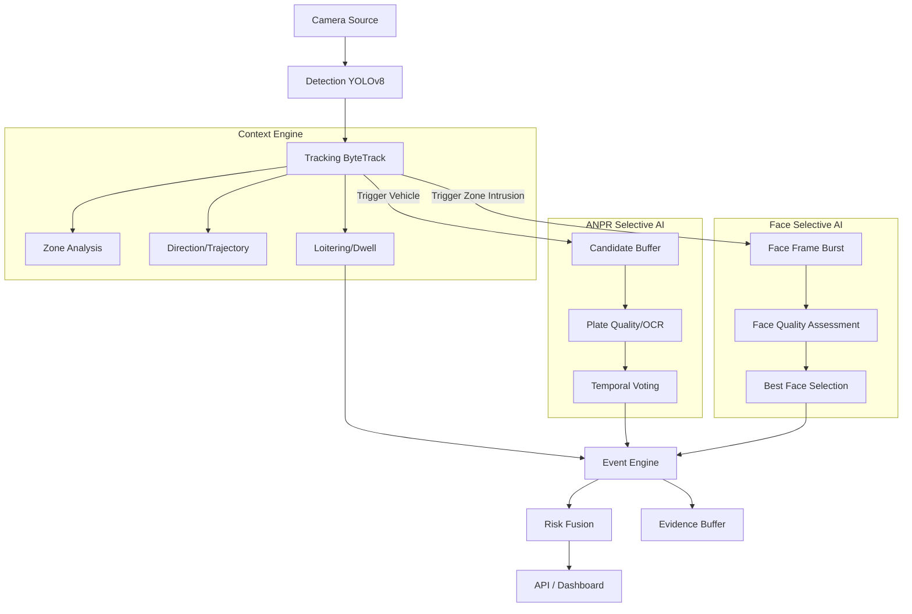

# Architecture: AI-Based Intelligent Video Analytics Platform for Border Surveillance

## Overview
This document outlines the architecture for the SIH PS187 Border AI system. The core design philosophy is **selective AI inference**: avoid running heavy models on every frame, and instead cascade from lightweight detection into specialist models only when necessary.

## System Architecture

## Key Principles
- **Event-driven**: Alerts are generated from temporal sequences, not single frames.
- **Edge-first**: Optimized to run with minimal compute.
- **Camera-agnostic**: Works with any RTSP stream or video file.
- **Explainable**: All alerts provide a clear list of reasons (risk fusion).

## Event Lifecycle & Deduplication
To prevent log spam (e.g. generating an alert every frame an object is loitering), the `EventEngine` employs a state machine:
- **CANDIDATE**: The object is tracked but hasn't met the rule thresholds (e.g. dwell time < 2s).
- **ACTIVE**: The object has met thresholds. A single `EventSchema` is generated. Its `max_risk_score` is continuously updated as long as the object escalates.
- **RESOLVED**: The object leaves the zone or disappears. The event is finalized and closed.

## Selective ANPR module
- **Trigger**: Only runs on objects tracked as vehicles (`car`, `truck`, `bus`, `motorcycle`).
- **Sampling**: Captures a burst of 5 frames.
- **Voting**: Performs a confidence-weighted consensus on the OCR strings to mitigate single-frame errors. Outputs `UNKNOWN` if consensus is low.
- **Failure isolation**: If ANPR OCR fails or crashes, it degrades gracefully without crashing the core detection/tracking pipeline.
